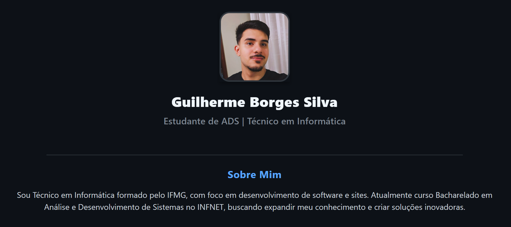

# Meu Perfil - App React Native



App de perfil pessoal desenvolvido com React Native, mostrando informações profissionais e de contato.

## 📱 Sobre o Projeto

Este é um aplicativo mobile simples desenvolvido para exibir um perfil profissional, utilizei como referência o tema escuro do GitHub Dark Mode.

## 📦 Instalação

1. Clone o repositório:
```bash
git clone https://github.com/Guilherme-Borges-Silva/meu-perfil.git
cd meu-perfil
```

2. Instale as dependências:
```bash
npm install
```

3. Inicie o app:
```bash
npx expo start
```

## 💻 Desenvolvedor

**Guilherme Borges Silva**
- Técnico em Informática (IFMG)
- Estudante de Análise e Desenvolvimento de Sistemas (INFNET)
- E-mail: guilhermeborgessilva04@gmail.com
- LinkedIn: /in/guilherme-borges-silva

## 📝 Licença

Este projeto é de uso pessoal e educacional.
